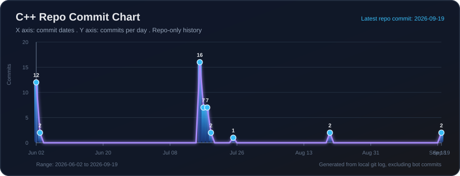

# C++ Learning Lab

<div align="center">


# Building C++ One Concept At A Time

This repository is my personal C++ practice space, organized module by module so every topic is easy to find, revisit, compile, and improve.

[Explore Modules](#module-map) . [Run Programs](#run-a-program) . [Commit Graph](#commit-pulse) . [Roadmap](#learning-roadmap)

</div>

---

## About This Repo

I am learning C++ from the foundations upward. Each folder is a small checkpoint in the journey: simple programs, focused examples, and hands-on practice with the language.

The goal is not just to write code. The goal is to understand how C++ thinks.

## What Makes It Interesting

- Clean module-by-module structure for easy learning.
- Small programs that focus on one concept at a time.
- Beginner-friendly examples that can be compiled quickly.
- A growing timeline of progress through commits and practice.
- A learning-first setup where every file has a purpose.

## Module Map

| Module | Topic Area | What It Covers | Files |
|---|---|---|---|
| Module 02 | Escape Sequences | Printing text, numbers, and special output formatting | [Open](Module%2002/escape%20sequence) |
| Module 02 | Variables | Basic variable declaration and usage | [Open](Module%2002/Variable%20declaration) |
| Module 02 | Arithmetic Operators | Arithmetic, increment, and decrement operators | [Open](Module%2002/ArithmeticOperators) |

## Current File Tree

This tree is auto-generated from the module folders and hides compiled `.exe` files.

<!-- FILE_TREE_START -->
```text
C++/
|-- .vscode/
|   `-- tasks.json
|-- Module 02/
|   |-- ArithmeticOperators/
|   |   |-- AreaOfCircle.cpp
|   |   |-- arithmaticoperators.cpp
|   |   |-- BooleanDataType.cpp
|   |   |-- CalculatePercentage.cpp
|   |   |-- FindReminder.cpp
|   |   |-- FloatDataTypes.cpp
|   |   |-- incrementDecrement.cpp
|   |   |-- ModulusOperator.cpp
|   |   |-- pto.cpp
|   |   `-- SimpleInterest.cpp
|   |-- Assignments/
|   |   |-- Q1.cpp
|   |   |-- Q2.cpp
|   |   |-- Q3.cpp
|   |   |-- Q4.cpp
|   |   |-- Q5.cpp
|   |   `-- Q6.cpp
|   |-- Char Data Type/
|   |   |-- question on typecasting/
|   |   |   |-- BrainTeaser.cpp
|   |   |   |-- PrintFractionalPart.cpp
|   |   |   `-- PrintHalfOfTheNumber.cpp
|   |   |-- char.cpp
|   |   `-- Typecasting.cpp
|   |-- escape sequence/
|   |   |-- helloworld.cpp
|   |   |-- printing_number.cpp
|   |   `-- pto.cpp
|   |-- Hierachy Of Operators/
|   |   |-- pto.cpp
|   |   `-- pto2.cpp
|   |-- Taking Input From User/
|   |   |-- cinSeInput.cpp
|   |   |-- pto.cpp
|   |   `-- SumOfTwoNumber.cpp
|   |-- Types of Operator/
|   |   |-- operators.cpp
|   |   |-- PTO.cpp
|   |   `-- tempCodeRunnerFile.cpp
|   `-- Variable declaration/
|       `-- variables.cpp
`-- Module 03/
    |-- AbsoluteValue.cpp
    |-- CheckThreeDigitNumber.cpp
    |-- DivisibleByFive.cpp
    |-- IfElse.cpp
    `-- ProfitAndLoss.cpp
```
<!-- FILE_TREE_END -->

## Run A Program

Use any C++ compiler such as `g++`.

```bash
g++ "Module 02/ArithmeticOperators/incrementDecrement.cpp" -o incrementDecrement
./incrementDecrement
```

On Windows PowerShell:

```powershell
g++ "Module 02\ArithmeticOperators\incrementDecrement.cpp" -o incrementDecrement.exe
.\incrementDecrement.exe
```

## Commit Pulse

This chart is generated from this repository's own Git history. It updates after new commits are pushed to `main`, so it shows progress for this C++ repo only.

<div align="center">



</div>

The chart and file tree are refreshed automatically by [update-commit-graph.yml](.github/workflows/update-commit-graph.yml).

## Learning Roadmap

| Status | Concept | Notes |
|---|---|---|
| Done | Hello World | First output programs |
| Done | Escape Sequences | Formatting output |
| Done | Variables | Declaring and using values |
| Done | Arithmetic Operators | Basic math operations |
| Done | Increment / Decrement | `++` and `--` operators |
| Next | Input / Output | Reading values from users |
| Next | Conditions | `if`, `else`, and decision making |
| Next | Loops | Repeating logic with `for`, `while`, and `do while` |
| Next | Functions | Breaking programs into reusable blocks |
| Next | Arrays and Strings | Working with collections and text |
| Next | Pointers | Understanding memory basics |
| Next | OOP | Classes, objects, constructors, and inheritance |

## Practice Style

```cpp
#include <iostream>
using namespace std;

int main()
{
    int skill = 1;
    skill++;

    cout << "Learning level: " << skill << endl;
    return 0;
}
```

## Repository Philosophy

```text
Learn the concept.
Write the code.
Run the program.
Fix the mistake.
Commit the progress.
Repeat.
```

## Quick Links

- [Arithmetic Operators](Module%2002/ArithmeticOperators)
- [Variable Declaration](Module%2002/Variable%20declaration)
- [Escape Sequence](Module%2002/escape%20sequence)

## Notes To Future Me

- Keep every program small and clear.
- Add comments only where they help understanding.
- Keep modules organized by topic.
- Push progress often so the commit graph shows the journey.
- Build projects after learning the basics.

---

<div align="center">

### Made while learning C++

Every commit is one step closer to mastery.

</div>
